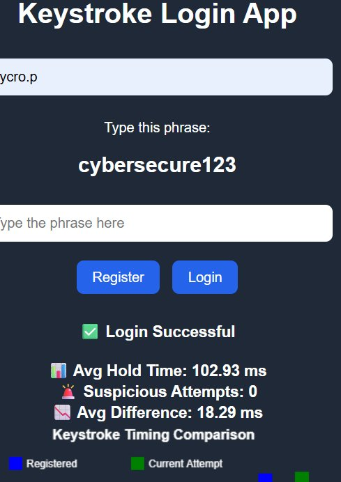
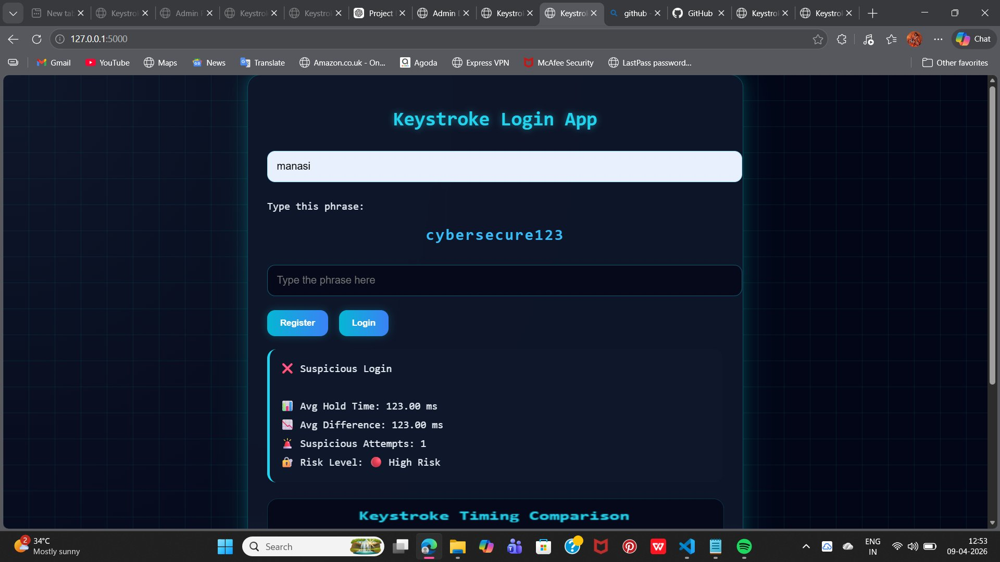
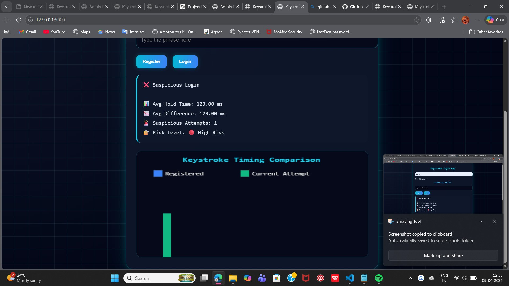
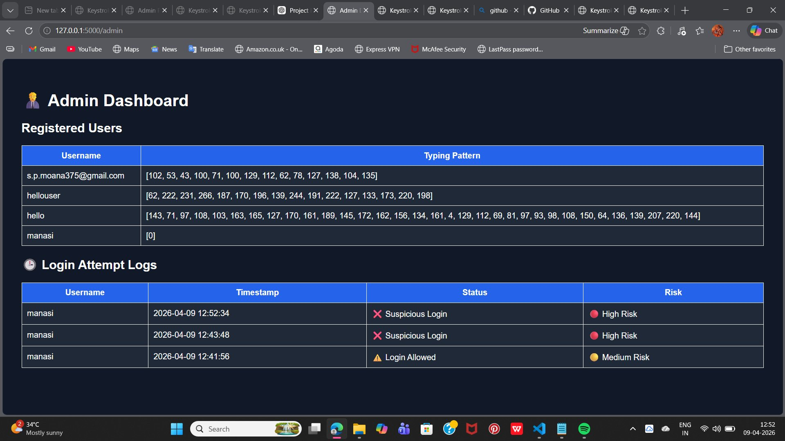

# 🔐 Keystroke Dynamics Authentication System

A behavioral biometric authentication system that verifies users based on **how they type** — not just what they type. Built with Python Flask and SQLite, featuring a cybersecurity-themed neon dashboard UI.

---

## What is Keystroke Dynamics?

Keystroke dynamics is a behavioral biometric that analyzes typing rhythm — specifically **how long each key is held down** (dwell time). Even when two people type the same phrase, their timing patterns differ enough to distinguish them.

This project captures those patterns during registration and compares them at login using statistical distance scoring to determine whether the person typing matches the registered user.

---

## Screenshots

### Main Interface — Login Successful


### Suspicious Login Detected


### Keystroke Timing Comparison Chart


### Admin Dashboard


---

## Features

- **Behavioral enrollment** — Records keystroke hold times as your typing profile
- **Pattern-based login** — Compares live input against your stored profile in real time
- **Risk scoring** — Classifies each attempt as Low / Medium / High risk based on timing deviation
- **Live visualization** — Canvas chart comparing registered vs. current keystroke timing side by side
- **Admin dashboard** — View all registered users, stored patterns, and full login history
- **Audit logs** — Timestamped login attempts with status and risk level
- **Persistent storage** — SQLite database, zero external setup required
- **Neon cyberpunk UI** — Dark terminal-style interface with cyan glow effects and grid overlay

---

## Tech Stack

| Layer | Technology |
|-------|------------|
| Backend | Python, Flask |
| Frontend | HTML, CSS, JavaScript |
| Database | SQLite |
| Biometric Logic | Keystroke dwell time (hold duration per key) |
| Visualization | HTML5 Canvas |

---

## Project Structure

```
keystroke-dynamics-authentication/
├── app.py                   # Flask app — routes, DB logic, API endpoints
├── requirements.txt
├── keystroke.db             # Auto-generated SQLite database
├── templates/
│   ├── index.html           # Main authentication UI
│   └── admin.html           # Admin dashboard (users + logs)
├── static/
│   ├── style.css            # Neon cybersecurity theme
│   └── script.js            # Keystroke capture, scoring, and canvas chart
└── screenshots/
```

---

## Getting Started

**Prerequisites:** Python 3.8+

```bash
# Clone the repo
git clone https://github.com/yourusername/keystroke-dynamics-authentication.git
cd keystroke-dynamics-authentication

# Install dependencies
pip install -r requirements.txt

# Start the server
python app.py
```

Open `http://localhost:5000` in your browser.  
Admin dashboard is available at `http://localhost:5000/admin`.

---

## How It Works

### Registration
1. Enter a username and type the phrase **`cybersecure123`**
2. The app records how long each key is held (in milliseconds)
3. That timing array is saved to the SQLite database as your profile

### Login
1. Enter your username and type the same phrase again
2. The app fetches your stored pattern and compares it key-by-key
3. It calculates the **average timing difference** between your stored and current input

### Risk Decision

| Avg Difference | Result | Risk Level |
|---|---|---|
| < 20 ms | ✅ Login Successful | 🟢 Low Risk |
| 20 – 40 ms | ⚠️ Login Allowed | 🟡 Medium Risk |
| > 40 ms | ❌ Suspicious Login | 🔴 High Risk |

All attempts — successful or not — are logged with a timestamp, status, and risk level visible in the admin dashboard.

---

## API Endpoints

| Method | Endpoint | Description |
|--------|----------|-------------|
| `POST` | `/register` | Save username and keystroke pattern |
| `GET` | `/get_user/<username>` | Retrieve stored pattern for a user |
| `POST` | `/log_attempt` | Log a login attempt with status and risk |
| `GET` | `/admin` | Admin dashboard with users and logs |

---

## Limitations & Notes

- The phrase is currently hardcoded as `cybersecure123` — it can be made configurable
- Pattern matching uses a single-sample average; accuracy improves with multi-sample enrollment
- This is a research/educational project — not intended as a standalone production auth system
- Best used as a **second factor** alongside traditional password-based authentication

---

## License

MIT
